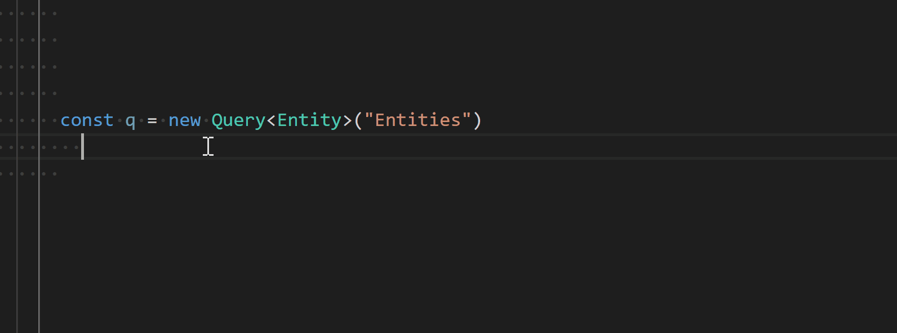
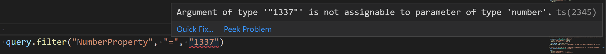
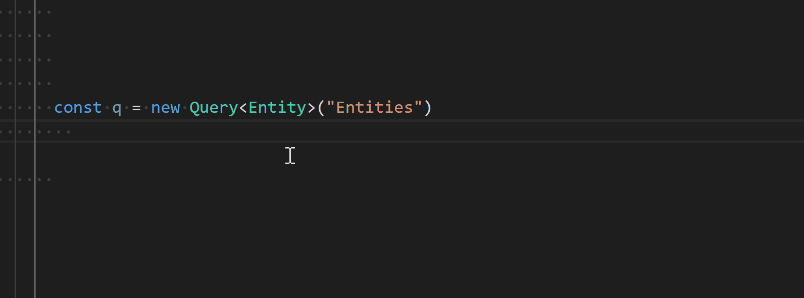

# odata-uri-builder
Build OData-uris - the TypeScript way.

## What is this lib (and what it´s not)

This lib strongly follows the Single-Responsibility-Principle (SRP), as it only assists in building OData-uris in a fully type-safe way, utilizing TypeScript´s awesome type-system to gain a mostly assisted coding experience.

It does not come packed with any mechanism to actually send requests or even parse responses of any kind. This is to ensure most flexibility/compatibility with any given framework or lib out there.

It is just that, an uri-builder (ok, maybe on type-script-steroids, but that is intended ;)

Developed for an internal project initially, we released the lib into the open and give back something to this great developer-community.

### Prerequisites

Grab the package from npm

TBD

### building queries
odata-uri-builder´s exposed fluent-API makes heavy use of TypeScript to assist in code-completion, etc. . Wherever appropriate, the lib uses the type-system to compile-time-check the validity of expressions.

Therefore, the lib itself needs some input-types in order to be able to utilize the type-system. (See [OData-TS-Generator](https://github.com/ikemtz/OData-TS-Generator) or [NSWAG](https://github.com/RicoSuter/NSwag) to obtain generated client interfaces / classes)
For the below examples, the following interfaces are considered to be existent (and written by hand this time :) )

```

	interface Root {
	  Child: Entity;
	}

	interface Entity {
	  NumberProperty: number | null;
	  StringProperty: string;
	  BooleanProperty: boolean,
	  NavigationProperty: Detail;
	  DateProperty: Date;
	}
	
	interface Detail {
	  NumberProperty: number;
	  StringProperty: string;
	}

```

Most of the exposed API of odata-uri-builder can be called either via a keyof T, or with a lambda/arrow-function. Keyof T is mostly sufficient, if the query is composed only of top-level properties from the type, wheras lambdas provide more assistance when going deeper into the type-structure. 

#### filtering (strongly typed)

Filtering can be done by first newing up a Query, and then drill down into the filter()-fluent-API.

		const query = new Query<Entity>("Entities")

Filters are specified in accordance to the OData-spec itself, in the "Property" "Operator" "Value" pattern. 
To obtain tha actual query, just call 

			query.toString()

> generated query strings for the below samples will be provided via quote


The first two parameters are fully Code-completable

			query.filter("NumberProperty", "=", 1337)
				 .and("StringProperty", "!=", "1337");

> Entities?$filter=(NumberProperty eq 1337) and (StringProperty ne '1337')



The lib also checks the type of the specified value when filtering. The following query will give an error, as the provided value (string) does not match the filtered property-type (number):

			query.filter("NumberProperty", "=", "1337");




Lambdas work also on top-level properties, but are even more flexible when going deeper into the type´s structure:

			query.filter(x => x.NavigationProperty.NumberProperty, "=", 1337);

> Entities?$filter=(NavigationProperty/NumberProperty eq 1337)



More samples to come...meanwhile, see the [Query.spec.ts](src/tests/Query.spec.ts) for more usage-samples

## Running the tests

run

```
npm test
```

for a one-time run of the testsuite or

```
npm testWatch
```

to launch the continious karma-test process

## Contributing

Please read [CONTRIBUTING.md](CONTRIBUTING.md) for details on our code of conduct, and the process for submitting pull requests to us.

## Versioning

We use [SemVer](http://semver.org/) for versioning. For the versions available, see the [tags on this repository](https://github.com/earloc/odata-uri-builder/tags). 

## Authors

* **Alexander Clare** - *Initial work* - [earloc](https://github.com/earloc)
* **Benjamin Scervino** - *Initial work*

See also the list of [contributors](https://github.com/earloc/odata-uri-builder/contributors) who participated in this project.

## License

This project is licensed under the MIT License - see the [LICENSE](LICENSE) file for details

## Acknoledgements
* everyone out there participating in open-source-projects. Keep up folks! Without you, we wouldn´t be where we are today!

